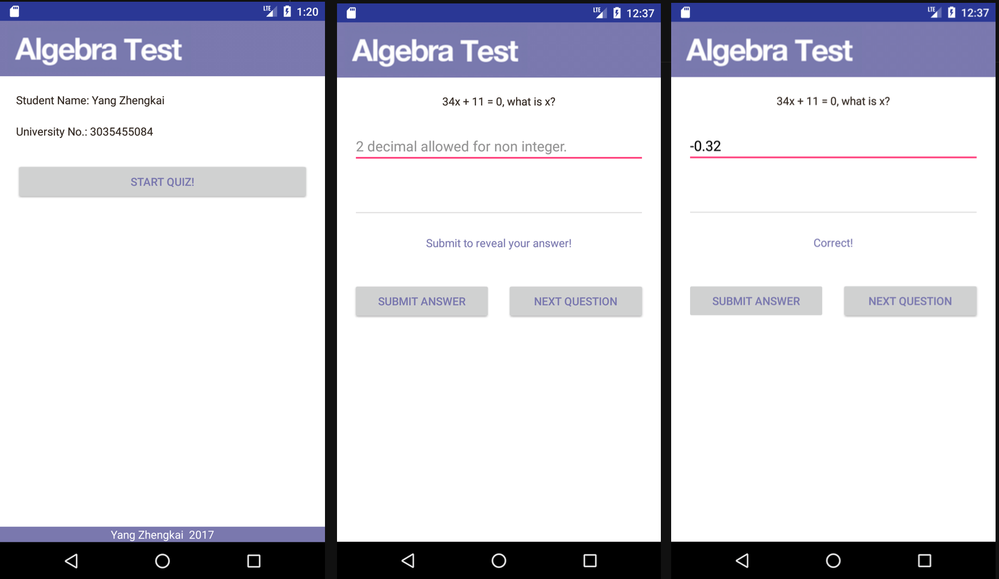
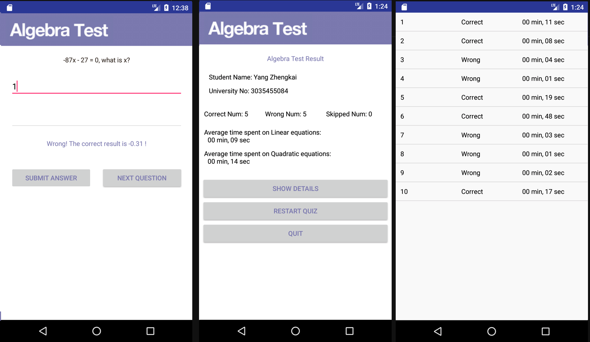

# AlgerbraTest
AlgerbraTest is an Android application aiming to practice students' ability in solving algebraic equations. The application mainly focuses on linear and quadratic equations.
Each round will generate five linear equations and five quadratic equations for students to solve, resulting a report including:

* Personal Information
* Correctness
* Duration

# Screenshots

# Requirements
* Android Studio 2.3.x
* Android 7.0 SDK
* API Level, 21 or newer

# Building
* Make sure you've installed the Android 7.0 SDK and upgraded to the latest version of Android Studio
* The demo is tested on the AVD (Nexus 5X API 24, Resolution 1080x1920: 420dpi)

